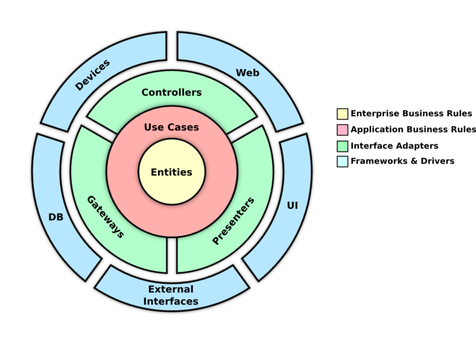

# Node Clean Architecture

NodeJS backend created using Clean Architecture Principles.

## Project Structure

### Stack

- NodeJS 18
- Prisma ORM
- Typescript
- MongoDB
- ExpressJS

### Architecture

The Architecture was built following **Robert Cecil Martin's Clean Architecture structure.**



The folders are sub-divided in 4 layers, each one represented by one folder in src:

- **Domain**: Here is where all the business logic is. All the application models (not meaning the database models). All the [usecases](./src/domain/usecases/), and all the [interfaces](/src/domain/protocols/) for the other layers are here. This layers does not depends on any other layer to exist, and also does not have any external libraries dependencies.
- **Infra**: Here is where all the backend implementations that does not talk with the user are. This layer only know about the Domain layer, and it implements most of the of the Domain Layer. The infra layer has implementation from external libraries, which in this case implements the [domain repositories using Prisma](/src/infra//prisma/repositories/), and also the [Hasher and JWT](/src/infra/criptography/) using external libraries. The infra layer also implements [Adapters](/src/infra/prisma/adapter/) to adapte between the DatabaseModel and the ApplicationModel.
- **Presentation**: This layer implements all the interfaces for the user, which means in this case, all the API interfaces ([controllers](/src/presentation//controllers/), [middlewares](/src/presentation//middlewares/)). Even though it is the API interface, it also does not depends on any framework to work.
- **Main**: Here is where everything comes together. So, this layer knows about all the others. The [factories](/src/main/factories/) folder is where every dependency is injected on the use cases and controllers and middlewares. The [Express Adapter](/src/main/adapters/express-adapter.ts) adapter all the controllers and middlewares to run with express. And the [Routes](/src/main/express/routes.ts) file setup all the routes path, setting up middlewares for each route, and also its correct controller.

The [server file](./src/server.ts) starts the app and serves the api.

### Models

This API has 4 Models:

- **Company**:
  - **Name**: Company's name
  - **Code**: It could a CNPJ in Brazil, or anything that could identifies a company.
- **User**:
  - **Name**: User's name
  - **Email**: User's email. Used to login.
  - **Password**: User's password. Used to login. It's save hashed in the database.
  - **CompanyId**: The company's id that this user belongs to.
  - **Role**: Enum that represents the role of the user in the application. It can be _SuperAdmin_, _Admin_ or _User_. See [Permissions](#permissions) section.
- **Unit**:
  - **Name**: Unit's name
  - **Description**: Unit's description
  - **CompanyId**: The company's id that this unit belongs to.
- **Asset**:
  - **UnitId**: Unit that this asset belongs to.
  - **Name**: Asset's name;
  - **Description**: Asset's description;
  - **Model**: I decided to model it as a string, since I don't have any information about how this model should be.
  - **Owner**: Owner's name. I decided to put it as a string, since I was not sure if it should be a application user.
  - **Status**: It's an enum that represents the status for Assets. It can be _Running_, _Alerting_ or _Stopped_. **Default is Running**.
  - **Health Level**: It's a number between 0 and 10 that represents the health level of the asset. I didn't put any constraint between Health level and status, but it could be a business decision to set status based on health level. **Default is 100**.
  - **ImageURL**: An URL to represents the image. Looking forward, we could receive an base64 image through the api and save it on S3 instance for example;

### Authentication

The authentication is using a simple **JWT Token** that does not expires. In order to get it, you must have an user created, and use the **/login** route passing your email and password to it.

All the routes besides the login routes requires authentication.

So, in order to authenticate and use the other routes, you must pass a header containing an **Authorization** param, with the following sintax: **Bearer YOUR_TOKEN** .

### Permissions

This application has 3 roles for users, and depending on each type, you can acess different things and routes:

- **SuperAdmin**: Can do anything in the application. Add new users, assets, units. It is the only user that can setup other SuperAdmin users, and also that can create, list, update, and delete companies.
- **Admin**: This user can access any information related to your own company. CRUD new users (Admin or normal users) for them and CRUD its own company unit and assets.
- **User**: This user can only access units and assets routes, and only for his own company. It cannot add, list or delete new users, and can only get and update it's own.

### How to use the API

In order to use the API, please take a look at the [swagger DOCS](http://localhost:3000/docs/).

### Deployment

All of the project was build using Docker. So, in the root folder you can find 2 docker-compose.yml files, one for development and for production, and also, one [Dockerfile](Dockerfile) that builds a docker image using the NodeJS image.

The Docker image is built using the Multi Stage feature, and also uses the Node-alpine for production which is much ligther.

You can deploy the app using the [docker compose for production file](./docker-compose-prod.yml)

## Running Locally

### Setup

1. Install [Docker.](https://docs.docker.com/engine/install/)
2. Setup .env file base on the [env.example](./.env.example) file.

### Run

The backend run as default on port **3000**.

```sh
    docker compose up
```

### Seeding

In order to seed the database with some initial data, you can use the seed's file in the [seeds](./backend/seeds) folder.

In order to run the seeds:

1. Start the backend server:

```sh
    docker compose up
```

2. Run the **yarn seed** command inside the container:

```sh
docker exec node-clean-architecture-api-1 yarn seed

```

### Linting

This project is using ESLint as the linter, following **standard-with-typescript** rules.

You can run the lint command by running:

```sh
    yarn lint
```

Add the _--fix_ flag to fix auto-fixable problems:

```sh
    yarn lint --fix
```
